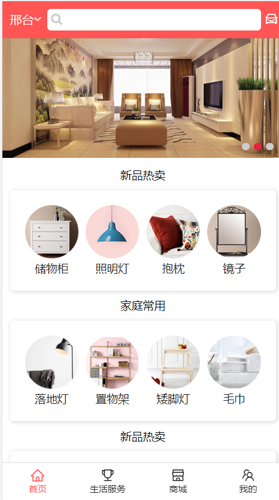
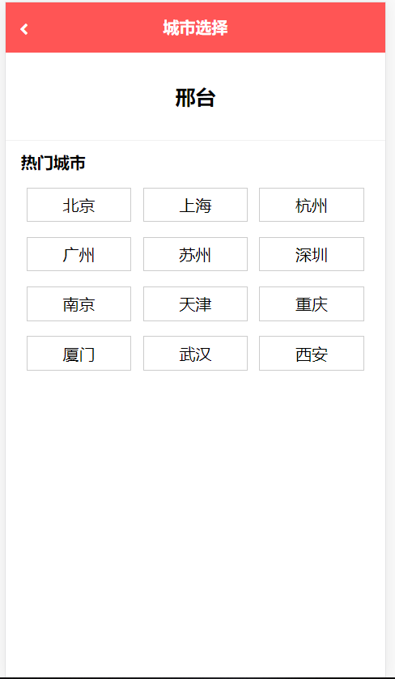
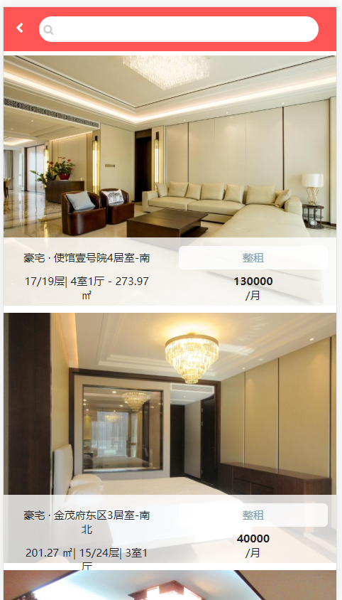
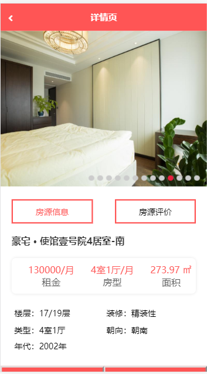
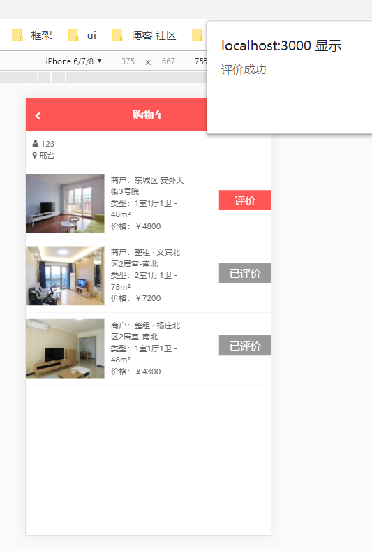
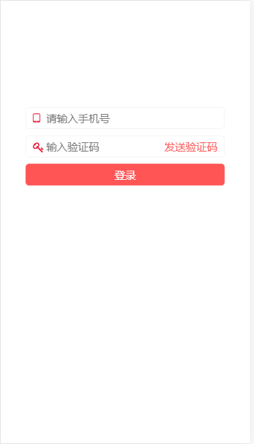

## 这是一个租房的 web app 

#### 技术栈 react + redux + react-router + swiper + less + fetch 

### 首页

点击左上角的城市 跳转到定位页面,点击切换城市

点击右上角的购物车,如果没有登录的话,跳转到登录页面,登陆后跳转到购物车页面,

购物车页面显示了用户用户名,获取的redux内存储的数据

搜索框输入内容后,按回车跳转到 搜索页面,点击搜索页面的数据 ,跳转到详情页,路由携带参数(id)

### 定位

### 搜索

### 详情

### 购物车

### 登录

## 环境配置

下载之后npm install 安装依赖

server目录下 node index.js 启动服务器

根目录 npm start  运行项目

localhost:3000 访问项目